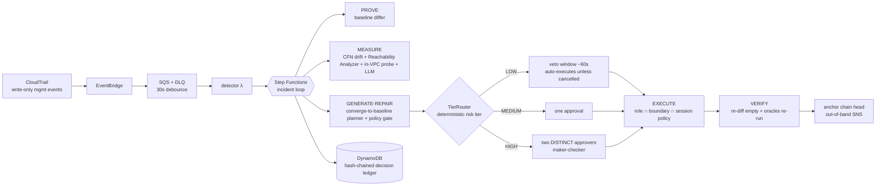

# Agentic NetOps — a closed-loop AI network remediation platform on AWS

An autonomous network-operations platform that manages a lab VPC as its production
network. When the network drifts from declared intent, the platform runs a deliberately
engineered closed loop:

**DETECT → PROVE → MEASURE → GENERATE-REPAIR → APPROVE → EXECUTE → VERIFY**

Every stage has an owning deterministic oracle. The LLM drafts diagnosis narratives and
repair rationales; its fault-class hypothesis is *scored against the deterministic
classification, never trusted* — control flow is driven by config diffs, not model output.
**The LLM proposes, deterministic systems dispose.**



## The loop, stage by stage

| Stage | Mechanism | Owning oracle |
|---|---|---|
| DETECT | CloudTrail → EventBridge → SQS → detector (correlation, idempotency, self-change suppression) | — |
| PROVE | live snapshot diffed against the declared baseline (canonical JSON captured at lab deploy) | **intent** — deterministic differ; CFN drift detection corroborates |
| MEASURE | LLM diagnosis (scored) + policy-selected checks per fault class | **impact** — VPC Reachability Analyzer; **data-plane** — in-VPC probe (raw DNS + TCP, zero SDK calls) |
| GENERATE-REPAIR | deterministic converge-to-baseline planner | **policy gate** — versioned Python rules; converge-only makes free-form fixes structurally impossible |
| APPROVE | **tier-routed** (ADR 0011): LOW auto-executes behind a ~60s veto window, MEDIUM takes one approval, HIGH requires two distinct approvers. Step Functions task tokens, 24h expiry | **human** (or an un-exercised veto, for LOW) |
| EXECUTE | per-incident STS creds: RemediationRole ∩ permissions boundary ∩ session policy listing only the approved plan's ARNs | scoped IAM |
| VERIFY | re-snapshot → diff must be empty; RA and probe re-run and must go green. An applicable check that was skipped/inconclusive closes the incident `VERIFICATION_LIMITED`, never as fully verified | all applicable |

A resolved incident's ledger reads as an evidence chain: *broken-proven* (RA:
`reachable: false`) → *fixed-proven* (re-diff empty, RA: `reachable: true`), and its head is
anchored out-of-band so the record can't be quietly rewritten.

Live results (measured, not estimated): a **MEDIUM** path — seed → detected 48 s →
gate-passed plan awaiting approval 93 s → approved → resolved **129 s**. A **LOW** path —
seed → detected → veto window opens → nobody intervenes → self-healed **191 s**, no human
touch. A **HIGH** path — first approval, same-user second attempt rejected **403**, distinct
second approver → resolved.

## Fault taxonomy (9 seeded classes, all eval-labeled)

sg-ingress-removed · sg-open-world · sg-egress-removed · route-deleted ·
route-blackholed · nacl-deny-inserted · rtb-assoc-swapped · sg-swapped-on-eni ·
dns-disabled — see `scripts/chaos.py`. Remediation is always "converge to baseline",
so multi-fault diffs heal correctly regardless of classification.

## Cost discipline ($0 idle, ≤$15 total)

- No NAT, no interface endpoints, no EC2, no Config recorder, no always-on compute.
  Reachability Analyzer path endpoints are **free unattached ENIs** (verified).
- RA is the only metered oracle: **hard-capped in code** (DynamoDB atomic counter,
  fail-closed; ADR 0005). Past the cap incidents close as `VERIFICATION_LIMITED`.
- A $10 monthly budget with email alerts, plus 3 CloudWatch alarms (change-DLQ depth,
  RA-budget-exhausted, workflow failed) and 7-day log retention on every function.
- See `docs/costs.md` for the per-unit economics and the running actuals.

## Governance & assurance

- **Autonomy tiers** — a deterministic, fail-closed risk tier routes each incident:
  **LOW** auto-executes behind a 60s **veto window** (human-on-the-loop), **MEDIUM** takes one
  approval, **HIGH** requires **two distinct approvers** (maker-checker). A global kill-switch
  forces everything to a human. The tier never changes *what* the fix does — the gate still
  bounds it to converge-to-baseline — only *who signs off*.
- **Tamper-evident ledger** — every decision is a link in a per-incident SHA-256 hash chain;
  `verify_ledger` detects any alteration/insertion/deletion at the exact sequence number.
- **Compliance evidence export** — `GET /incidents/{id}/evidence` produces an auditor-ready
  package mapping the incident to six control assertions (authorized, least-privilege,
  verified, human-oversight, within-policy, tamper-evident).

## Engineering evidence

- 134 automated tests, credential-free CI (moto-mocked; `tests/conftest.py` makes real AWS
  unreachable), static ASL validation, and a **standing adversarial red-team suite**
  (`tests/test_redteam.py`) that re-checks tier-forcing, plan-tampering, replayed approvals,
  two-party bypass, and ledger-tampering on every run
- **Adversarially audited** on three fronts (IAM/STS/gate/wallet, injection/auth,
  infra/supply-chain) plus an attack-surface analysis of the auto-execute path (A1–A7) — see
  `docs/SECURITY.md`. Highlights: an independent (non-tautological) policy gate, tag-scoped
  remediation boundary, config-as-trust-boundary IAM, exact-identity detector guard, SoD
- 15 ADRs including live-verified IAM/platform facts — start with `docs/adr/README.md`;
  conventions (error-handling policy, single-sources-of-truth) in `docs/conventions.md`
- **Self-audited a second time**: a bug-hunt / architecture / docs review of this repo found
  ~30 issues — including a policy gate that was tautological, a tamper-evidence claim that
  wasn't implemented, and a "kill-switch" test that re-implemented the rule it verified. All
  fixed, each with a regression test; the corrections are recorded in the ADRs rather than
  quietly patched
- Local parity: `scripts/local_incident.py` runs the deterministic loop spine for all
  9 classes with zero AWS; Ollama swap-in for the LLM (`MODEL_PROVIDER=ollama`)
- Eval-gated model releases: `scripts/release_model.ps1` blocks any model that scores
  below diagnosis ≥ 8/9 or remediation < 9/9 (`docs/evals.md`)
- Scripted teardown / one-command restore

## Run it

**Prerequisites:** an AWS account + credentials (`aws sts get-caller-identity` must work),
AWS SAM CLI ≥ 1.163, Python 3.12, PowerShell, and Docker (only for `dev.ps1`'s local parity
stack). Everything deploys to `us-east-1`; the stack names are set in `samconfig.toml`.

```powershell
python -m venv .venv; .venv\Scripts\python -m pip install -r requirements-dev.txt
.\scripts\check.ps1                                # ruff + pytest + cfn-lint + sam validate
.\scripts\deploy_lab.ps1                           # lab VPC (the drift target) + baseline
.\scripts\deploy_platform.ps1                      # platform stack
.\scripts\deploy_ui.ps1                            # console (prints its URL)

# operators. TWO are needed to exercise HIGH-tier two-party approval.
.\scripts\create_user.ps1 -Email you@x.com     -Password <12+ chars>
.\scripts\create_user.ps1 -Email second@x.com  -Password <12+ chars>

# map each operator to the IAM principal they act as, so an approver who CAUSED the drift
# is blocked (segregation of duties -- inert until this map is populated).
.venv\Scripts\python scripts\seed_baseline.py --approver you@x.com=arn:aws:iam::<acct>:user/you
```

Drive it:

```powershell
.\scripts\demo.ps1 -Fault sg-ingress-removed   # LOW: watch the veto countdown, do nothing -> self-heals
.\scripts\demo.ps1 -Fault nacl-deny-inserted   # MEDIUM: approve once in the console
.\scripts\demo.ps1 -Fault sg-open-world        # HIGH: needs BOTH operators
.venv\Scripts\python scripts\chaos.py --restore     # put the lab back
.venv\Scripts\python scripts\evaluate.py            # full 9-class eval (~$1 of RA)
```

Audit any incident (read-only, no console needed):

```powershell
.venv\Scripts\python scripts\verify_ledger.py <incident-id>       # cryptographic chain check
.venv\Scripts\python scripts\compliance_export.py <incident-id>   # auditor-ready control report
```

Operational switches:

```powershell
.venv\Scripts\python scripts\seed_baseline.py --autonomy manual   # kill-switch: no auto-execute
.venv\Scripts\python scripts\seed_baseline.py --autonomy normal   # re-enable LOW-tier autonomy
.venv\Scripts\python scripts\seed_baseline.py --mode maintenance  # suppress detection during a deploy
.\scripts\teardown.ps1                                           # back to $0.00
```

Local parity, zero AWS: `.\scripts\dev.ps1` then
`.venv\Scripts\python scripts\local_incident.py sg-ingress-removed [--ollama]` runs the
deterministic spine (diff → classify → plan → gate) against in-memory fixtures.
