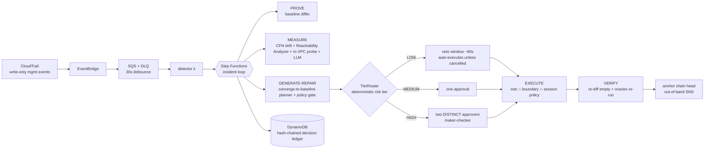

# Agentic NetOps — a closed-loop AI network remediation platform on AWS

[](https://github.com/haeganm/agentic-netops/actions/workflows/ci.yml)
[](LICENSE)

An autonomous network-operations platform that manages a lab VPC as its production
network. When the network drifts from declared intent, the platform runs a deliberately
engineered closed loop:

**DETECT → PROVE → MEASURE → GENERATE-REPAIR → APPROVE → EXECUTE → VERIFY**

Every stage has an owning deterministic oracle. The LLM drafts diagnosis narratives and
repair rationales; its fault-class hypothesis is *scored against the deterministic
classification, never trusted* — control flow is driven by config diffs, not model output.
**The LLM proposes, deterministic systems dispose.**



## The loop, stage by stage

| Stage | Mechanism | Owning oracle |
|---|---|---|
| DETECT | CloudTrail → EventBridge → SQS → detector (correlation, idempotency, self-change suppression) | — |
| PROVE | live snapshot diffed against the declared baseline (canonical JSON captured at lab deploy) | **intent** — deterministic differ; CFN drift detection corroborates |
| MEASURE | LLM diagnosis (scored) + policy-selected checks per fault class | **impact** — VPC Reachability Analyzer; **data-plane** — in-VPC probe (raw DNS + TCP, zero SDK calls) |
| GENERATE-REPAIR | deterministic converge-to-baseline planner | **policy gate** — versioned Python rules; converge-only makes free-form fixes structurally impossible |
| APPROVE | **tier-routed** (ADR 0011): LOW auto-executes behind a ~60s veto window, MEDIUM takes one approval, HIGH requires two distinct approvers. Step Functions task tokens, 24h expiry | **human** (or an un-exercised veto, for LOW) |
| EXECUTE | per-incident STS creds: RemediationRole ∩ permissions boundary ∩ session policy listing only the approved plan's ARNs | scoped IAM |
| VERIFY | re-snapshot → diff must be empty; RA and probe re-run and must go green. An applicable check that was skipped/inconclusive closes the incident `VERIFICATION_LIMITED`, never as fully verified | all applicable |

A resolved incident's ledger reads as an evidence chain: *broken-proven* (RA:
`reachable: false`) → *fixed-proven* (re-diff empty, RA: `reachable: true`), and its head is
anchored out-of-band so the record can't be quietly rewritten.

Live results (measured, not estimated): a **MEDIUM** path — seed → detected 48 s →
gate-passed plan awaiting approval 93 s → approved → resolved **129 s**. A **LOW** path —
seed → detected → veto window opens → nobody intervenes → self-healed **191 s**, no human
touch. A **HIGH** path — first approval, same-user second attempt rejected **403**, distinct
second approver → resolved.

## Fault taxonomy (9 seeded classes, all eval-labeled)

sg-ingress-removed · sg-open-world · sg-egress-removed · route-deleted ·
route-blackholed · nacl-deny-inserted · rtb-assoc-swapped · sg-swapped-on-eni ·
dns-disabled — see `scripts/chaos.py`. Remediation is always "converge to baseline",
so multi-fault diffs heal correctly regardless of classification.

## Cost discipline ($0 idle, ≤$15 total)

- No NAT, no interface endpoints, no EC2, no Config recorder, no always-on compute.
  Reachability Analyzer path endpoints are **free unattached ENIs** (verified).
- RA is the only metered oracle: **hard-capped in code** (DynamoDB atomic counter,
  fail-closed; ADR 0005). Past the cap incidents close as `VERIFICATION_LIMITED`.
- A $10 monthly budget with email alerts, plus 4 CloudWatch alarms (change-DLQ depth,
  API-403 burst, RA-budget-exhausted, workflow failed) and 7-day log retention on every
  function.
- See `docs/costs.md` for the per-unit economics and the running actuals.

## Governance & assurance

- **Autonomy tiers** — a deterministic, fail-closed risk tier routes each incident:
  **LOW** auto-executes behind a 60s **veto window** (human-on-the-loop), **MEDIUM** takes one
  approval, **HIGH** requires **two distinct approvers** (maker-checker). A global kill-switch
  forces everything to a human. The tier never changes *what* the fix does — the gate still
  bounds it to converge-to-baseline — only *who signs off*.
- **Segregation of duties as recusal** — whoever caused the drift is removed from *every*
  decision on their own change: approve, reject **and** veto (ADR 0016). Approve-only SoD looks
  sufficient until the drift *is* the security hole, at which point blocking the repair preserves
  it, and the ledger records that as a routine decision.
- **Tamper-evident ledger** — every decision is a link in a per-incident SHA-256 hash chain;
  `verify_ledger` detects any alteration/insertion/deletion at the exact sequence number.
- **Compliance evidence export** — `GET /incidents/{id}/evidence` produces an auditor-ready
  package mapping the incident to six control assertions (authorized, least-privilege,
  verified, human-oversight, within-policy, tamper-evident).

## Engineering evidence

- A credential-free pytest suite (179 tests at the 2026-09 audit; moto-mocked, and
  `tests/conftest.py` installs bogus static credentials so any stray real-AWS call fails
  authentication), static ASL validation, and a **standing adversarial red-team suite**
  (`tests/test_redteam.py`) that re-checks tier-forcing, plan-tampering, replayed approvals,
  two-party bypass, and ledger-tampering on every run
- **Adversarially audited three times**: IAM/STS/gate/wallet + injection/auth +
  infra/supply-chain; an attack-surface analysis of the auto-execute path (A1–A8); and a pass on
  the identity/authorization perimeter run against the **deployed** stack — see
  `docs/SECURITY.md`. Highlights: an independent (non-tautological) policy gate, a tag-scoped
  remediation boundary proven action-by-action by `scripts/verify_boundary.py` (18/18 at the
  last live run; the action set has since gained `ec2:AssociateRouteTable`), config-as-trust-boundary
  IAM, an exact-identity detector guard, and segregation of duties as full recusal (ADR 0016)
- 16 ADRs including live-verified IAM/platform facts — start with `docs/adr/README.md`;
  conventions (error-handling policy, single-sources-of-truth) in `docs/conventions.md`
- **Findings that only live testing could catch** are recorded rather than quietly fixed: a green
  9/9 eval once coexisted with *every* console approval returning 500, because the eval harness
  completes task tokens with admin credentials and never touches the API. `docs/evals.md` now
  says so in the caveat, and a regression test guards the IAM that caused it
- **Self-audited a second time**: a bug-hunt / architecture / docs review of this repo found
  ~30 issues — including a policy gate that was tautological, a tamper-evidence claim that
  wasn't implemented, and a "kill-switch" test that re-implemented the rule it verified. All
  fixed, each with a regression test; the corrections are recorded in the ADRs rather than
  quietly patched
- Local parity: `scripts/local_incident.py` runs the deterministic loop spine for all
  9 classes with zero AWS; Ollama swap-in for the LLM (`MODEL_PROVIDER=ollama`)
- Eval-gated model releases: `scripts/release_model.ps1` blocks any model that scores
  below diagnosis ≥ 8/9 or remediation < 9/9 (`docs/evals.md`)
- Scripted teardown / one-command restore

## Run it

**Prerequisites:** an AWS account + credentials (`aws sts get-caller-identity` must work)
with **Bedrock model access enabled for Amazon Nova in us-east-1** (without it the loop
still heals — the LLM is advisory — but every diagnosis is empty and the console shows
"llm agrees: -"),
AWS SAM CLI ≥ 1.163, Python 3.12+ (CI runs 3.12 — the Lambda runtime — and 3.13 is
verified locally; note `sam build` wants a `python3.12` binary, so a 3.13-only machine
needs `sam build --use-container`, which needs Docker), PowerShell (Windows PowerShell 5.1 or
[PowerShell 7 / `pwsh`](https://github.com/PowerShell/PowerShell) — the scripts run on
Windows, macOS, and Linux), and Docker (only for `dev.ps1`'s local parity stack).
Everything deploys to `us-east-1`. `samconfig.toml` names the platform stack
(`netops-platform`); the lab stack name `netops-lab` is hardcoded in the deploy/teardown
scripts (overridable via the `LAB_STACK` env var in `chaos.py`/`seed_baseline.py`).

The commands below are written Windows-style. On macOS/Linux run the same `.ps1` scripts
under `pwsh`, and wherever a command says `.venv\Scripts\python`, use `.venv/bin/python`
(the venv layout differs per OS; the scripts themselves detect it).

```powershell
python -m venv .venv; .venv\Scripts\python -m pip install -r requirements-dev.txt   # macOS/Linux: python3 -m venv .venv
.\scripts\check.ps1                                # ruff + pytest + cfn-lint + sam validate
.\scripts\deploy_lab.ps1                           # lab VPC. First run warns "platform stack not up yet" - expected
.\scripts\deploy_platform.ps1                      # platform stack
.venv\Scripts\python scripts\seed_baseline.py      # NOW capture the baseline (the lab deploy ran before the table existed)
.\scripts\deploy_ui.ps1                            # console (prints its URL)

# Operators. You need TWO NON-ADMIN operators to exercise HIGH-tier two-party approval.
# Why non-admin: segregation of duties blocks whoever CAUSED the drift from approving the fix,
# and chaos.py runs as your admin identity -- so an operator mapped to that admin ARN is
# blocked from approving every seeded fault, leaving too few eligible approvers for two-party.
.\scripts\create_user.ps1 -Email opsA@x.com -Password <12+ chars, upper+lower+digit>
.\scripts\create_user.ps1 -Email opsB@x.com -Password <12+ chars, upper+lower+digit>

# Optionally map YOUR admin identity to an operator account, purely to see the SoD block fire:
# that account will then be refused on anything you break yourself (403), which is the point.
.venv\Scripts\python scripts\seed_baseline.py --approver you@x.com=arn:aws:iam::<acct>:user/you
```

Drive it:

```powershell
.\scripts\demo.ps1 -Fault sg-ingress-removed   # LOW: watch the veto countdown, do nothing -> self-heals
.\scripts\demo.ps1 -Fault nacl-deny-inserted   # MEDIUM: approve once in the console
.\scripts\demo.ps1 -Fault sg-open-world        # HIGH: needs BOTH operators
.venv\Scripts\python scripts\chaos.py --restore     # put the lab back (see note below)
.venv\Scripts\python scripts\evaluate.py            # full 9-class eval (~$1 of RA)
```

Two things worth knowing when driving it by hand:

- **Restore between faults.** The tier is computed from the *whole current* diff, not just the
  newest break — so accumulated drift across several resources trips the broad-blast-radius rule
  and escalates everything to HIGH. That's correct behaviour, but it will surprise you.
  A *successful* remediation already converges the lab, so `--restore` is only needed after a
  veto or a failure.
- **`--restore` pauses detection for ~150 s.** It mutates as *you*, not as the RemediationRole
  the detector ignores, so without suppression the platform raises an incident for your own
  cleanup. The wait has to outlast CloudTrail delivery; pass `--no-wait` if you're about to seed
  another fault immediately anyway.

Audit any incident, and the platform's own guard rails (all read-only, no console needed):

```powershell
.venv\Scripts\python scripts\verify_ledger.py <incident-id>       # cryptographic chain check
.venv\Scripts\python scripts\compliance_export.py <incident-id>   # auditor-ready control report
.venv\Scripts\python scripts\verify_boundary.py                   # prove the IAM blast radius
```

`verify_boundary.py` is worth a look for *how* it verifies. The obvious test — assume
`RemediationRole` and try to touch an untagged resource — is impossible, because the trust policy
admits only the executor Lambda: the control's own correctness blocks its documented test. So it
proves the claim in three provable parts instead (per-action policy logic against the real
deployed boundary, live tag presence, and non-assumability), mutating nothing and costing nothing.

Operational switches:

```powershell
.venv\Scripts\python scripts\seed_baseline.py --autonomy manual   # kill-switch: no auto-execute
.venv\Scripts\python scripts\seed_baseline.py --autonomy normal   # re-enable LOW-tier autonomy
.venv\Scripts\python scripts\seed_baseline.py --mode maintenance  # suppress detection during a deploy
```

## Teardown and rebuild

The platform is designed to live at **$0.00 idle**, but it can also be torn down completely
between demos and rebuilt on demand.

```powershell
.\scripts\teardown.ps1          # empty buckets, drop deletion protection, delete all 3 stacks
.\scripts\verify_teardown.ps1   # PROVE nothing is left that can bill (exit 0 = safe to walk away)
```

`teardown.ps1` fails loudly rather than reporting success optimistically — an earlier version
printed `idle bill $0.00` unconditionally, even when both stack deletions had failed. The order it
uses is not cosmetic: deletion protection must come off the table first, buckets must be emptied
before CloudFormation will delete them (and SAM's artifact bucket is *versioned*, so noncurrent
versions and delete markers have to go too), and the CloudFront distribution takes 15–25 minutes
to disable and propagate — slow, not stuck.

One ordering constraint is self-inflicted and worth knowing: **the platform's own operation blocks
the lab's teardown.** Every Reachability Analyzer run creates an analysis, and a
`NetworkInsightsPath` cannot be deleted while any analysis exists against it — so the lab stack
fails on its two paths, and then on the route table they transitively pin. Analyses cost nothing
to retain, which is precisely why this stayed hidden: it is a teardown-completeness bug, not a
cost one. The script now clears them first, and retries each stack once, because EC2's dependency
checks lag a few seconds behind deletions.

`verify_teardown.ps1` is the one that matters. It checks every resource class by name, then sweeps
**ten regions** for the classes that actually cost real money — an orphaned Elastic IP is
~$3.60/month and no name-based search would ever find it. It also asserts, as a *positive*, that a
budget alarm survives: that's the tripwire if any of this is wrong. It deliberately never calls the
Cost Explorer API, which bills $0.01 per request — a spend-checking tool should not be a line item
on the bill it checks.

**Rebuilding:**

```powershell
$env:NETOPS_ALERT_EMAIL = "you@example.com"
# -OperatorEmail matters: without it restore.ps1 creates the operator under the ALERT email,
# and the --approver mapping two lines down would name an account that doesn't exist
.\scripts\restore.ps1 -OperatorEmail opsA@x.com -OperatorPassword "<12+ chars, upper+lower+digit>"
.\scripts\create_user.ps1 -Email opsB@x.com -Password "<...>"  # second operator: HIGH tier needs two
.venv\Scripts\python scripts\seed_baseline.py --approver opsA@x.com=arn:aws:iam::<acct>:user/<you>
```

**What does not come back** — worth reading once so a rebuild holds no surprises:

- **All incident and eval history.** The rebuilt system starts with an empty ledger. DynamoDB
  point-in-time recovery does *not* survive the table, so `docs/artifacts/` holds the only
  preserved copy (see the README there).
- **The Reachability Analyzer counter resets to 0/30** — another $3 of headroom. The hard cap is
  per *deployment*, not per project lifetime; `docs/costs.md` is the authoritative record of
  cumulative spend.
- **Two non-admin operators are required** for HIGH-tier two-party approval (ADR 0016), and
  `restore.ps1` creates at most one. The `CONFIG#APPROVERS` map also needs its own `--approver`
  run; a bare `seed_baseline.py` seeds an empty map and warns that segregation of duties cannot
  fire.
- **The SNS email subscription needs re-confirming by clicking the email**, or ledger-anchor
  notifications silently never arrive.
- Every generated identifier changes (API id, user pool id, table name, CloudFront domain).
  Nothing in the repo hardcodes them — `ui/config.js` is generated at deploy — so no
  documentation edits are needed.
- `deploy_lab.ps1` calls `seed_baseline.py` before the platform stack exists, so a clean rebuild
  prints two expected failure warnings. Harmless.

Local parity, zero AWS: `.\scripts\dev.ps1` then
`.venv\Scripts\python scripts\local_incident.py sg-ingress-removed [--ollama]` runs the
deterministic spine (diff → classify → plan → gate) against in-memory fixtures.
